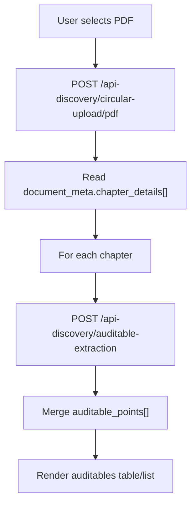

# PDF to Auditable Frontend Guide

This guide is for frontend developers building a UI where a user uploads a circular PDF and sees extracted auditable points.

The flow uses two synchronous server APIs. There is no single endpoint that accepts a PDF and directly returns all auditables.

## Base URLs

| Environment | Base URL |
| --- | --- |
| Local default | `http://localhost:8001` |
| Dev server | `http://dev.gravity.ind.in:8001` |

All examples below use `/api-discovery/`. The same APIPurpose routes are also mounted under `/best-payment/`.

## API Sequence

1. Upload the circular PDF.
2. Read `document_meta.chapter_details[]` from the parse response.
3. For each chapter, call auditable extraction with that single chapter.
4. Merge all `auditable_points[]` for display.



## Step 1: Upload Circular PDF

Endpoint:

- `POST /api-discovery/circular-upload/pdf`

Request:

- `multipart/form-data`
- required field: `file`

Curl:

```bash
curl --location "http://dev.gravity.ind.in:8001/api-discovery/circular-upload/pdf" \
  --form 'file=@"/path/to/circular.pdf"'
```

Success response shape:

```json
{
  "document_meta": {
    "title": "PFRDA Guidance Note on Recordkeeping and Reporting Controls",
    "circular_number": "PFRDA/2026/OPS/019",
    "regulator": "PFRDA",
    "regulator_department": "Operations Division",
    "circular_issue_date": "2026-03-12",
    "addressed_instiute": "All Pension Funds and Central Recordkeeping Agencies",
    "circular_type": "Guidance Note",
    "referenced_documents": "Reporting Standards Framework 2025",
    "chapter_details": [
      {
        "chapter_number": "2",
        "chapter_name": "Books, Records, and Regulatory Returns",
        "chapter_text": "Every intermediary shall maintain accurate...",
        "from_page": "6",
        "to_page": "8",
        "footers": ["PFRDA Ops Note 2026", "Internal"]
      }
    ]
  }
}
```

Frontend handling:

- Treat `document_meta.chapter_details` as the chapter list.
- Each chapter must have non-empty `chapter_text` before calling auditable extraction.
- If no chapters are returned, show an empty/failed parse state.

## Step 2: Extract Auditables Per Chapter

Endpoint:

- `POST /api-discovery/auditable-extraction`

Request:

- `application/json`
- accepts exactly one `chapter_details` object per call
- `history` is optional; use `[]` unless you intentionally maintain Gemini conversation context

Curl:

```bash
curl --location "http://dev.gravity.ind.in:8001/api-discovery/auditable-extraction" \
  --header "Content-Type: application/json" \
  --data '{
    "document_meta": {
      "title": "PFRDA Guidance Note on Recordkeeping and Reporting Controls",
      "circular_number": "PFRDA/2026/OPS/019",
      "regulator": "PFRDA",
      "regulator_department": "Operations Division",
      "circular_issue_date": "2026-03-12",
      "addressed_instiute": "All Pension Funds and Central Recordkeeping Agencies",
      "circular_type": "Guidance Note",
      "referenced_documents": "Reporting Standards Framework 2025"
    },
    "chapter_details": {
      "chapter_number": "2",
      "chapter_name": "Books, Records, and Regulatory Returns",
      "chapter_text": "Every intermediary shall maintain accurate...",
      "from_page": "6",
      "to_page": "8",
      "footers": ["PFRDA Ops Note 2026", "Internal"]
    },
    "history": []
  }'
```

Success response shape:

```json
{
  "auditable_points": [
    {
      "auditable_point_text": "Maintain accurate, complete, and retrievable books and records for all regulated activities.",
      "reason": "This clause defines an auditable recordkeeping obligation.",
      "penalty": "",
      "deadline": "",
      "score_of_acceptance": 0.92,
      "embeddings": [],
      "system_derived_data": {},
      "department": [],
      "department_top2": []
    }
  ],
  "non_auditable": []
}
```

## TypeScript Interfaces

```ts
export interface CircularParseResponse {
  document_meta: DocumentMetaWithChapters;
}

export interface DocumentMetaWithChapters extends DocumentMeta {
  chapter_details: ChapterDetails[];
}

export interface DocumentMeta {
  title?: string;
  circular_number?: string;
  regulator?: string;
  regulator_department?: string;
  circular_issue_date?: string;
  addressed_instiute?: string;
  circular_type?: string;
  referenced_documents?: string;
}

export interface ChapterDetails {
  chapter_number?: string | number;
  chapter_name?: string;
  chapter_text: string;
  from_page?: string | number;
  to_page?: string | number;
  footers?: string[];
}

export interface AuditableExtractionRequest {
  document_meta: DocumentMeta;
  chapter_details: ChapterDetails;
  history: unknown[];
}

export interface AuditableExtractionResponse {
  auditable_points: AuditablePoint[];
  non_auditable: unknown[];
}

export interface AuditablePoint {
  auditable_point_text: string;
  reason: string;
  penalty: string;
  deadline: string;
  score_of_acceptance: number;
  embeddings?: number[];
  system_derived_data?: Record<string, unknown>;
  department?: number[] | unknown[];
  department_top2?: DepartmentPrediction[];
  [extraField: string]: unknown;
}

export interface DepartmentPrediction {
  department_id: number;
  department_name: string;
  score: number;
}

export interface ChapterAuditableResult {
  chapter_number?: string | number;
  chapter_name?: string;
  from_page?: string | number;
  to_page?: string | number;
  auditable_points: AuditablePoint[];
  non_auditable: unknown[];
  error?: string;
}
```

## Frontend Pseudo-Code

```ts
const BASE_URL = "http://dev.gravity.ind.in:8001";

async function parseCircularPdf(file: File): Promise<CircularParseResponse> {
  const formData = new FormData();
  formData.append("file", file);

  const response = await fetch(`${BASE_URL}/api-discovery/circular-upload/pdf`, {
    method: "POST",
    body: formData,
  });

  if (!response.ok) {
    throw new Error(`Circular parse failed: ${response.status}`);
  }

  return response.json();
}

async function extractAuditablesForChapter(
  documentMeta: DocumentMeta,
  chapter: ChapterDetails
): Promise<AuditableExtractionResponse> {
  const response = await fetch(`${BASE_URL}/api-discovery/auditable-extraction`, {
    method: "POST",
    headers: { "Content-Type": "application/json" },
    body: JSON.stringify({
      document_meta: documentMeta,
      chapter_details: chapter,
      history: [],
    }),
  });

  const body = await response.json().catch(() => ({}));

  if (!response.ok) {
    throw new Error(body.error || `Auditable extraction failed: ${response.status}`);
  }

  return body;
}

export async function uploadPdfAndExtractAuditables(
  file: File,
  onProgress: (done: number, total: number) => void
): Promise<ChapterAuditableResult[]> {
  const parsed = await parseCircularPdf(file);
  const metaWithChapters = parsed.document_meta;
  const chapters = metaWithChapters.chapter_details || [];

  const { chapter_details, ...documentMeta } = metaWithChapters;
  const results: ChapterAuditableResult[] = [];

  for (let index = 0; index < chapters.length; index += 1) {
    const chapter = chapters[index];

    try {
      const extraction = await extractAuditablesForChapter(documentMeta, chapter);
      results.push({
        chapter_number: chapter.chapter_number,
        chapter_name: chapter.chapter_name,
        from_page: chapter.from_page,
        to_page: chapter.to_page,
        auditable_points: extraction.auditable_points || [],
        non_auditable: extraction.non_auditable || [],
      });
    } catch (error) {
      results.push({
        chapter_number: chapter.chapter_number,
        chapter_name: chapter.chapter_name,
        from_page: chapter.from_page,
        to_page: chapter.to_page,
        auditable_points: [],
        non_auditable: [],
        error: error instanceof Error ? error.message : String(error),
      });
    }

    onProgress(index + 1, chapters.length);
  }

  return results;
}
```

## Aggregating Results for Display

```ts
const chapterResults = await uploadPdfAndExtractAuditables(file, setProgress);

const allAuditables = chapterResults.flatMap((chapter) =>
  chapter.auditable_points.map((point) => ({
    ...point,
    chapter_number: chapter.chapter_number,
    chapter_name: chapter.chapter_name,
    from_page: chapter.from_page,
    to_page: chapter.to_page,
  }))
);

const failedChapters = chapterResults.filter((chapter) => chapter.error);
```

## UI States

| State | Trigger | Suggested UI |
| --- | --- | --- |
| `idle` | no file selected | file picker/drop zone |
| `uploading` | user submits PDF | disable submit and show upload indicator |
| `parsing` | `circular-upload/pdf` in progress | show "Parsing circular" status |
| `extracting` | per-chapter auditable calls running | show chapter progress, for example `3 / 12 chapters` |
| `partial_failure` | one or more chapter calls fail | show successful auditables plus failed chapter list |
| `completed` | all chapter calls finished | show auditable list/table |
| `empty` | parse has no chapters or no auditables found | show no-results state |

Because `auditable-extraction` is synchronous and one chapter per call, progress should be calculated from the number of chapters completed.

## Recommended Display Fields

| Field | Display guidance |
| --- | --- |
| `auditable_point_text` | primary text |
| `reason` | show as explanation/details |
| `penalty` | show blank or `Not mentioned` when empty |
| `deadline` | show blank or `Not mentioned` when empty |
| `score_of_acceptance` | display as `0..1` or convert to percentage |
| `department` | display ids only if the UI has no department catalog |
| `department_top2` | preferred department display when present |
| `system_derived_data` | optional advanced/details panel |
| `chapter_number`, `chapter_name`, `from_page`, `to_page` | include as source context after aggregation |

## Error Handling

| API | Status | Meaning |
| --- | --- | --- |
| `circular-upload/pdf` | `400` | missing PDF file |
| `circular-upload/pdf` | `500` | parser or Gemini failure |
| `auditable-extraction` | `400` | missing `document_meta`, missing `chapter_details`, or blank `chapter_text` |
| `auditable-extraction` | `500` | missing prompt, invalid Gemini JSON, or internal enrichment failure |
| `auditable-extraction` | `502` | Gemini returned no response |

Frontend behavior:

- If PDF parsing fails, stop the flow and show the parse error.
- If one chapter extraction fails, keep the auditables from successful chapters and show the failed chapter number/name.
- If `auditable_points` is empty for a chapter, treat it as a successful empty result.

## Important Notes

- Do not send the entire parser response as `document_meta` to `auditable-extraction`; remove or ignore the embedded `chapter_details` list and send one chapter separately.
- `addressed_instiute` is intentionally spelled that way in the current backend placeholders.
- The backend may include extra fields on auditable points. Preserve unknown fields if the UI supports detail drawers or export.
- `embeddings` can be large and usually should not be shown in the main UI.
- `department_top2` is only present in banking mode. Insurance mode can return only `department`.
